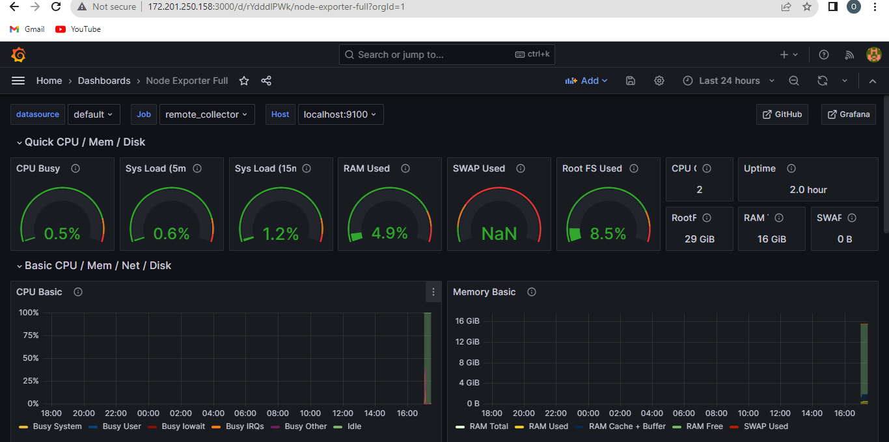

# Basic CI/CD Pipeline Setup using Jenkins, Git, Docker, SonarQube, Trivy, and Dependency Check

## 1. Introduction

### 1.1 Purpose
This document provides a comprehensive guide to set up a basic CI/CD pipeline using Jenkins, Git, Docker, SonarQube, Trivy, and Dependency Check. The pipeline aims to automate the building, testing, and deployment of software projects, ensuring continuous integration and delivery.

### 1.2 Scope
This guide is intended for software developers, DevOps engineers, and individuals involved in software development and deployment processes.

### 1.3 Audience
- Software Developers
- DevOps Engineers
- System Administrators

### 1.4 Document Conventions
- **Bold text:** Indicates actions or commands.
- *Italic text:* Indicates variable names or user-specific input.

## 2. Prerequisites

### 2.1 Software Requirements
- [Jenkins](https://www.jenkins.io/)
- [Git](https://git-scm.com/)
- [Docker](https://www.docker.com/)
- [SonarQube](https://www.sonarqube.org/)
- [OWASP Dependency-Check](https://owasp.org/www-project-dependency-check/)

### 2.2 Familiarity with Concepts
Basic understanding of version control (Git), containerization (Docker), and continuous integration principles.

## 3. Jenkins Installation

### 3.1 Download Jenkins
Visit the [Jenkins download page](https://www.jenkins.io/download/) and download the latest version for your platform.

### 3.2 Installation Steps
1. **Run** the Jenkins installer.
2. **Follow** the installation wizard instructions.
3. **Complete** the installation.


### 3.3 Access Jenkins
Open a web browser and navigate to `http://localhost:8080` to access the Jenkins dashboard. Follow the on-screen instructions to unlock Jenkins.


## 4. Git Installation

### 4.1 Download Git
Visit the [Git download page](https://git-scm.com/downloads) and download the latest version for your platform.

### 4.2 Installation Steps
1. **Run** the Git installer.
2. **Follow** the installation wizard instructions.
3. **Complete** the installation.


## 5. Docker Installation

### 5.1 Download Docker
Visit the [Docker download page](https://www.docker.com/get-started) and download the latest version for your platform.


### 5.2 Installation Steps
1. **Run** the Docker installer.
2. **Follow** the installation wizard instructions.
3. **Complete** the installation.


## 6. SonarQube Installation

### 6.1 Download SonarQube
Visit the [SonarQube download page](https://www.sonarqube.org/downloads/) and download the latest version.

### 6.2 Installation Steps
1. **Run** the SonarQube installer.
2. **Follow** the installation wizard instructions.
3. **Complete** the installation.


### 6.3 Start SonarQube
Run SonarQube using Docker:
```bash
docker run -d --name sonarqube -p 9000:9000 sonarqube
```


Access SonarQube at `http://localhost:9000` and use default credentials (admin/admin).

.png)

## 7. Dependency Check Installation

### 7.1 Download Dependency Check
Visit the [Dependency-Check GitHub releases page](https://github.com/jeremylong/DependencyCheck/releases) and download the latest version.


### 7.2 Installation Steps
1. **Extract** the Dependency Check archive.
2. **Configure** the tool according to project needs.

## 8. CI/CD Pipeline Configuration

### 8.1 Jenkins Configuration
- **Install** necessary plugins (Git, Docker, SonarQube, etc.) from the Jenkins dashboard.
- **Configure** Jenkins credentials for Git, Docker, and SonarQube.

```bash
pipeline {
    agent any
    tools {
        jdk 'jdk17'
        nodejs 'node16'
    }
    environment {
        SCANNER_HOME = tool 'sonar-scanner'
    }
    stages {
        stage('clean workspace') {
            steps {
                cleanWs()
            }
        }
        stage('Checkout from Git') {
            steps {
                git branch: 'main', url: 'https://github.com/olaoyefaith/netflixcloneDevSecOps-Project.git'
            }
        }
        stage("Sonarqube Analysis ") {
            steps {
                withSonarQubeEnv('sonar-server') {
                    sh ''' $SCANNER_HOME/bin/sonar-scanner -Dsonar.projectName=Netflix \
                    -Dsonar.projectKey=Netflix '''
                }
            }    
        }
        stage("quality gate") {
            steps {
                script {
                    waitForQualityGate abortPipeline: false, credentialsId: 'Sonar-token' 
                }
            } 
        }
        stage('Install Dependencies') {
            steps {
                sh "npm install"
            }
        }
        stage('OWASP FS SCAN') {
            steps {
                dependencyCheck additionalArguments: '--scan ./ --disableYarnAudit --disableNodeAudit', odcInstallation: 'DP-Check'
                dependencyCheckPublisher pattern: '**/dependency-check-report.xml'
            }
        }
        stage('TRIVY FS SCAN') {
            steps {
                sh "trivy fs . > trivyfs.txt"
            }
        }
        stage("Docker Build & Push") {
            steps {
                script {
                   withDockerRegistry(credentialsId: 'docker', toolName: 'docker') {   
                       sh "docker build --build-arg TMDB_V3_API_KEY=<your TMDB API key> -t netflix ."
                       sh "docker tag netflix olaoyefaith/netflix: "
                       sh "docker push  olaoyefaith/netflix:latest "
                    }
                }
            }
        }
        stage("TRIVY") {
            steps {
                sh "trivy image olaoyefaith/netflix:latest > trivyimage.txt" 
            }
        }
        stage('Deploy to container') {
            steps {
                sh 'docker run -d --name netflix -p 8081:80 olaoyefaith/netflix:latest'
            }
        }
    }
}
```

### 8.2 Create Jenkins Pipeline
1. **Create** a new pipeline job in Jenkins.
2. **Configure** the pipeline to fetch source code from the Git repository.
3. **Define** pipeline stages (Build, Test, SonarQube Analysis, Docker Build, etc.).


### 8.3

 Run the Pipeline
- **Trigger** the pipeline manually or configure webhooks for automatic triggering on code commits.


## 9. Prometheus and Grafana Integration

### 9.1 Prometheus Installation and Setup

#### 9.1.1 Download Prometheus
Visit the [Prometheus download page](https://prometheus.io/download/) and download the latest version for your platform.

#### 9.1.2 Installation Steps
1. **Extract** the Prometheus archive to a directory of your choice.
2. **Configure** the `prometheus.yml` file according to your monitoring requirements.

### 9.1.2 systemd

#### 9.1.2.1 Configure Prometheus

Edit the `prometheus.yml` configuration file:

```yaml
global:
  scrape_interval: 15s

scrape_configs:
  - job_name: 'myapp'
    static_configs:
      - targets: ['localhost:8081']  
```

#### 9.1.2.2 Create a systemd Service Unit

Create a systemd service unit file for Prometheus:

```bash
sudo nano /etc/systemd/system/prometheus.service
```

Add the following content to the file:

```ini
[Unit]
Description=Prometheus
Wants=network-online.target
After=network-online.target

[Service]
User=Promethues
ExecStart=/path/to/prometheus/prometheus 
--config.file=/etc/prometheus/prometheus.yml \
  --storage.tsdb.path=/data \
  --web.console.templates=/etc/prometheus/consoles \
  --web.console.libraries=/etc/prometheus/console_libraries \
  --web.listen-address=0.0.0.0:9090 \
  --web.enable-lifecycle
Restart=always

[Install]
WantedBy=default.target
```

#### 9.1.2.3 Reload systemd and Start Prometheus

Reload the systemd manager configuration:

```bash
sudo systemctl daemon-reload
```

Start Prometheus:

```bash
sudo systemctl start prometheus
```

Enable Prometheus to start on boot:

```bash
sudo systemctl enable prometheus
```

Now, Prometheus is running as a daemon process managed by systemd. You can check its status using:

```bash
sudo systemctl status prometheus
```


#### 9.1.3 Access Prometheus
Open a web browser and navigate to `http://localhost:9090` to access the Prometheus dashboard.


### 9.2 Grafana Installation and Setup

#### 9.2.1 Download Grafana
Visit the [Grafana download page](https://grafana.com/get) and download the latest version for your platform.

#### 9.2.2 Installation Steps
1. **Extract** the Grafana archive to a directory of your choice.
2. **Run** Grafana using the following command:
   ```bash
   ./bin/grafana-server
   ```


#### 9.2.3 Access Grafana
Open a web browser and navigate to `http://localhost:3000` to access the Grafana dashboard.

#### 9.2.4 Configure Prometheus as a Data Source in Grafana
1. Log in to Grafana (default credentials: admin/admin).
2. Add Prometheus as a data source.
3. Configure the Prometheus HTTP URL (`http://localhost:9090` by default).



## 10. Conclusion

### 10.1 Summary
This document has provided a step-by-step guide for setting up a comprehensive CI/CD pipeline using Jenkins, Git, Docker, SonarQube, Trivy, and Dependency Check. Additionally, it extended the pipeline with Prometheus and Grafana integration for enhanced monitoring capabilities, contributing to efficient and reliable software development practices.